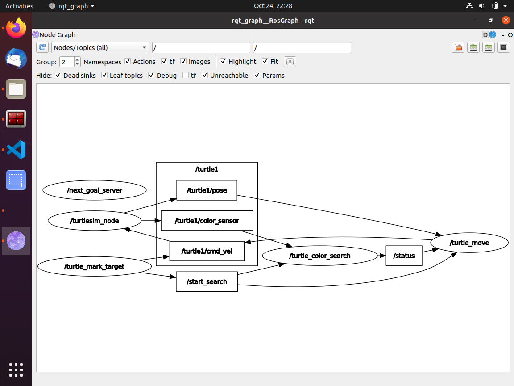
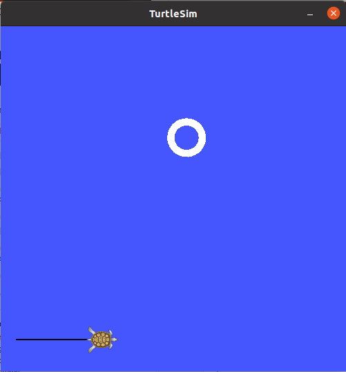
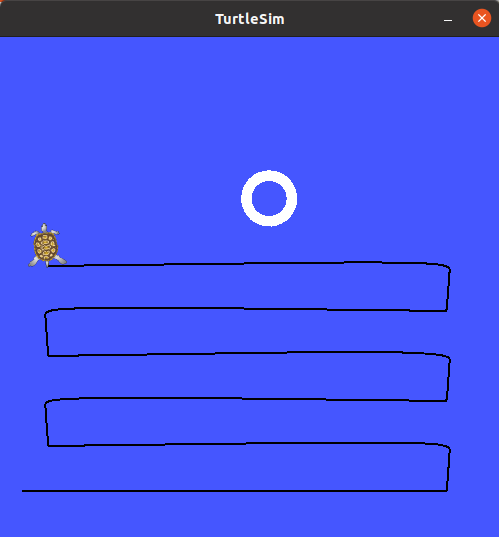

# Hide and seek game in ROS #

I created this game to practice with some of the beginner ROS concepts.  

The game will have the turtlesim robot search for a ball in it's workspace.  The starting parameters and search density be start parameters from the roslaunch file to place a ball at a x, y location and the search step size.  

Then turtlesim then will perform a search of the area in a zig-zag pattern with a specified search step size until it finds the ball using the color sensor.

## Learning items ##
- setting rosparam from roslaunch file: input for x, y and the search step size
- roslaunch of multiple nodes and ensuring they all start properly and are activated as setup continues (needed to create topics which advertised when the setup was complete)
- how to control the turtlesim robot to place the ball (go to goal algorithm)
- Subscribing to pose, color sensor to control the turtlesim robot and look for the ball
- building a search service which gives the next goal to the robot, search routine will be simply a zig-zag pattern with a spacing specified in the roslaunch file, search will always start at a search step distance from 0,0 
- implementing go-to-goal algorithm and ensure driving is smooth

