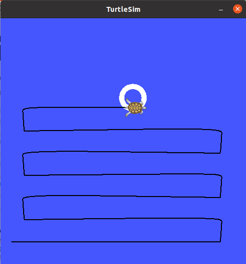

# Hide and seek game in ROS #

This game will set start parameters from the roslaunch file to place a ball at a x, y location.  

Then turtlesim will perform a search of the area in a zig-zag pattern until it finds the ball using the color sensor.

## Learning items ##
- rosparam input for x, y and radius of ball
- roslaunch of multiple nodes and ensuring they all start properly and are activated as setup continues
- how to control the turtlesim robot to place the ball
- Subscribing to pose, color sensor to control reactions
- building a search path, first search routine will be simply brute force zig-zag pattern, search will always start at 0,0
- implementing go-to-goal algorithm and ensure driving is smooth

